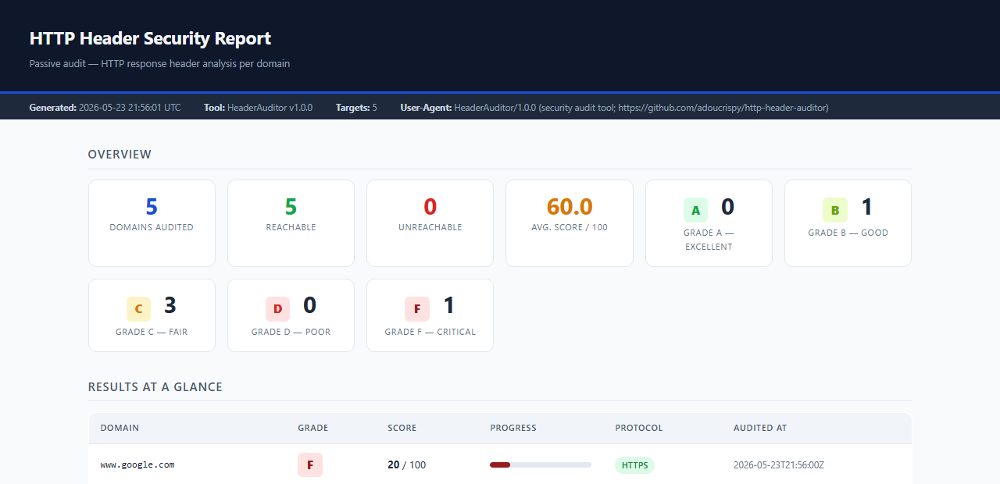
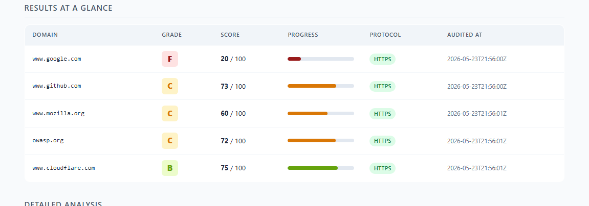
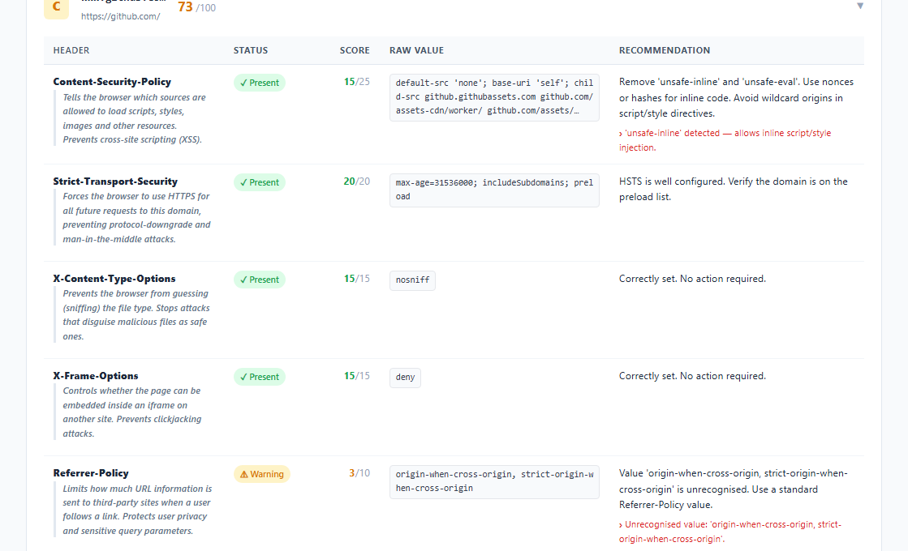

# HTTP Header Security Auditor

> Outil CLI d'audit passif des en-têtes de sécurité HTTP — génère un rapport HTML auto-contenu et un export JSON exploitable par des outils tiers.


---

## Table des matières

1. [Contexte et motivation](#contexte-et-motivation)
2. [Fonctionnalités](#fonctionnalités)
3. [Captures d'écran](#captures-décran)
4. [Installation](#installation)
5. [Utilisation](#utilisation)
6. [En-têtes analysés et scoring](#en-têtes-analysés-et-scoring)
7. [Échelle de grades](#échelle-de-grades)
8. [Résultats réels](#résultats-réels)
9. [Structure du rapport](#structure-du-rapport)
10. [Limites connues](#limites-connues)
11. [Références](#références)

---

## Contexte et motivation

Les en-têtes de réponse HTTP constituent la première ligne de défense entre un serveur web et un navigateur. Un serveur peut ordonner au navigateur d'imposer HTTPS, refuser l'intégration dans une iframe, restreindre les origines autorisées pour les scripts, et bien d'autres choses encore — le tout via quelques lignes d'en-tête envoyées avec chaque réponse.

Dans la pratique, ces en-têtes sont fréquemment absents, mal configurés ou laissés à leurs valeurs permissives par défaut. L'audit manuel est fastidieux et source d'erreurs à grande échelle. Cet outil automatise le processus :

- **Passif** — une seule requête HTTP standard par cible, pas de crawling, pas d'authentification, pas d'injection de charge utile.
- **Légal** — équivalent à ce que fait n'importe quel navigateur en visitant une page.
- **Actionnable** — chaque constat est accompagné d'une recommandation concrète, pas uniquement d'un signalement.
- **Portable** — la sortie est un fichier HTML unique qui fonctionne hors ligne et peut être joint à un rapport ou ouvert par un interlocuteur non technique.

---

## Fonctionnalités

- Analyse 7 en-têtes de sécurité par domaine : CSP, HSTS, X-Content-Type-Options, X-Frame-Options, Referrer-Policy, Permissions-Policy, X-XSS-Protection
- Système de scoring pondéré (0–100) → grade A à F inspiré de SSL Labs
- Suivi automatique des redirections (jusqu'à 5 sauts), chaînes HTTP → HTTPS incluses
- Les erreurs de certificat TLS sont signalées et l'audit continue (non bloquant)
- Les domaines injoignables produisent une ligne score zéro au lieu de faire planter l'exécution
- Rapport HTML entièrement auto-contenu (fichier unique, pas de CDN, fonctionne hors ligne), code couleur, lisible par un public non technique
- Export JSON exploitable par des pipelines CI ou des outils tiers
- Logging structuré (`INFO` par défaut, `DEBUG` avec `--verbose`)

---

## Captures d'écran

**Tableau de bord — vue d'ensemble et distribution des grades**



*En-tête de page avec les métadonnées (version, timestamp, user-agent), grille de statistiques affichant la distribution des grades sur l'ensemble des domaines audités, et début du tableau récapitulatif.*

---

**Résultats en un coup d'œil — tableau récapitulatif**



*Une ligne par domaine : badge de grade, score sur 100, barre de progression colorée selon le grade, protocole et horodatage de l'audit. Cliquer sur un nom de domaine amène directement à sa fiche détaillée.*

---

**Analyse détaillée — fiche par domaine**



*Fiche dépliée pour github.com (grade C, 73/100). Chaque ligne présente le nom de l'en-tête, une description pédagogique pour les lecteurs non techniques, un badge de statut (Présent / Avertissement / Absent / Déprécié), le score partiel, la valeur brute en police monospace et une recommandation concrète. Les anomalies détectées sont listées en rouge sous la recommandation.*

---

## Installation

**Prérequis :** Python 3.10+

```bash
git clone https://github.com/Adam-create/http-header-auditor.git
cd http-header-auditor
pip install requests jinja2
```

L'utilisation d'un environnement virtuel n'est pas obligatoire mais recommandée :

```bash
python -m venv .venv
source .venv/bin/activate   # Windows : .venv\Scripts\activate
pip install requests jinja2
```

---

## Utilisation

### Auditer un domaine unique

```bash
python auditor.py -u example.com
python auditor.py -u https://example.com
```

### Auditer une liste de domaines

```bash
python auditor.py -t targets.txt
```

`targets.txt` — un domaine ou une URL par ligne, les lignes commençant par `#` sont ignorées :

```
# Domaines de production
https://www.example.com
https://api.example.com
blog.example.com
```

### Référence complète des options

```
usage: auditor [-h] (-u DOMAIN | -t FILE) [--output DIR] [--json] [--verbose]

options:
  -u, --url DOMAIN      Domaine ou URL unique à auditer
  -t, --targets FILE    Fichier contenant un domaine/URL par ligne
  -o, --output DIR      Répertoire de sortie (défaut : ./output)
  --json                Exporte également les résultats en results.json
  --verbose             Active le logging niveau DEBUG
```

### Exemples

```bash
# Auditer un domaine en mode verbeux
python auditor.py -u github.com --verbose

# Auditer une liste, produire HTML + JSON dans un répertoire personnalisé
python auditor.py -t targets.txt --json --output ./rapports/2026-05-24

# Rediriger les logs vers un fichier
python auditor.py -t targets.txt --json 2>audit.log
```

### Fichiers générés

| Fichier | Toujours généré | Description |
|---|---|---|
| `output/report.html` | Oui | Rapport HTML interactif, auto-contenu |
| `output/results.json` | Avec `--json` | JSON structuré, un objet par domaine |

---

## En-têtes analysés et scoring

Chaque en-tête est évalué selon sa **présence**, la **correction de sa valeur** et sa **conformité** aux bonnes pratiques actuelles. Des points partiels sont attribués aux en-têtes présents mais mal configurés.

| En-tête | Poids | Ce qui est vérifié |
|---|---|---|
| `Content-Security-Policy` | 25 pts | Présence · absence de `unsafe-inline` / `unsafe-eval` · pas de wildcard dans les directives critiques |
| `Strict-Transport-Security` | 20 pts | `max-age` ≥ 31 536 000 s (1 an) · directive `includeSubDomains` |
| `X-Content-Type-Options` | 15 pts | Valeur exacte `nosniff` |
| `X-Frame-Options` | 15 pts | Valeur `DENY` ou `SAMEORIGIN` |
| `Referrer-Policy` | 10 pts | Valeur restrictive (`no-referrer`, `strict-origin`, `strict-origin-when-cross-origin`…) |
| `Permissions-Policy` | 10 pts | Présence · pas de wildcard sur les fonctionnalités sensibles (caméra, micro, géolocalisation…) |
| `X-XSS-Protection` | 5 pts | Déprécié — pas de pénalité si CSP présent en substitut moderne |

**Total : 100 pts**

### Logique de scoring détaillée

**CSP (25 pts)**
- `unsafe-inline` détecté → −10 pts (autorise l'injection de scripts/styles inline)
- `unsafe-eval` détecté → −10 pts (autorise `eval()` et fonctions similaires)
- Wildcard `*` dans `default-src`, `script-src` ou `style-src` → −5 pts
- Absent → 0 pts

**HSTS (20 pts)**
- `max-age` manquant → −10 pts
- `max-age` < 31 536 000 → −8 pts
- `includeSubDomains` absent → −5 pts
- En-tête absent → 0 pts

**X-XSS-Protection (5 pts)**
- Absent *et* CSP également absent → 0 pts (double lacune)
- Absent *mais* CSP présent → 5 pts (CSP est le substitut moderne)
- Présent → 5 pts + notice de dépréciation informative

---

## Échelle de grades

| Score | Grade | Interprétation |
|---|---|---|
| 90 – 100 | **A** | Excellent — en-têtes bien configurés |
| 75 – 89 | **B** | Bon — lacunes mineures, risque résiduel faible |
| 50 – 74 | **C** | Moyen — plusieurs en-têtes absents ou mal configurés |
| 25 – 49 | **D** | Insuffisant — exposition significative |
| 0 – 24 | **F** | Critique — majorité des en-têtes absents |

---

## Résultats réels

Audit réalisé le 23 mai 2026, une requête HEAD par domaine, sans authentification.

| Domaine | Grade | Score | Principaux constats |
|---|---|---|---|
| www.google.com | **F** | 20 / 100 | CSP présent mais contient `unsafe-inline` et `unsafe-eval` · Pas de `Permissions-Policy` · Pas de `X-Frame-Options` |
| www.github.com | **C** | 73 / 100 | CSP contient `unsafe-inline` (−10 pts) · `Referrer-Policy` non standard (3 / 10 pts) · Pas de `Permissions-Policy` |
| owasp.org | **C** | 72 / 100 | Pas de `Permissions-Policy` · `Referrer-Policy` partiellement restrictive |
| www.mozilla.org | **C** | 60 / 100 | CSP présent avec `unsafe-inline` · Pas de `Permissions-Policy` |
| www.cloudflare.com | **B** | 75 / 100 | Bon niveau global · `Referrer-Policy` non standard · Pas de `Permissions-Policy` |

**Observation :** `Permissions-Policy` est l'en-tête le plus systématiquement absent sur les cinq domaines testés, y compris ceux d'organisations spécialisées en sécurité. `Content-Security-Policy` est largement déployé mais rarement durci (l'exception `unsafe-inline` est quasi universelle, souvent imposée par des frameworks d'analytics ou des bibliothèques UI legacy).

---

## Structure du rapport

### Rapport HTML (`report.html`)

```
┌─ En-tête de page ─────────────────────────────────────────────┐
│  Nom de l'outil · "Audit passif — analyse des en-têtes HTTP"  │
├─ Bande de métadonnées ────────────────────────────────────────┤
│  Généré le · Version · Nombre de cibles · User-Agent          │
├─ Vue d'ensemble (grille de stats) ────────────────────────────┤
│  Domaines audités · Joignables · Injoignables · Score moyen   │
│  Distribution des grades A / B / C / D / F                    │
├─ Résultats en un coup d'œil (tableau récapitulatif) ──────────┤
│  Domaine · Badge de grade · Score · Barre de progression      │
├─ Analyse détaillée (une fiche repliable par domaine) ──────────┤
│  Par fiche :                                                   │
│    Badge de grade · Domaine · URL finale · Score              │
│    ┌─ Tableau des en-têtes ──────────────────────────────────┐ │
│    │ En-tête · Statut · Score · Valeur brute · Recommandation│ │
│    │ (× 7 lignes, une par en-tête analysé)                   │ │
│    └────────────────────────────────────────────────────────┘ │
└───────────────────────────────────────────────────────────────┘
```

Le rapport est un **fichier `.html` unique et auto-contenu** — pas de CDN, pas de polices externes, pas de bibliothèque JavaScript. Il s'ouvre dans n'importe quel navigateur sans connexion internet et peut être joint à un e-mail ou stocké dans un dépôt git.

### Export JSON (`results.json`)

```json
{
  "meta": {
    "tool_version": "1.0.0",
    "generated_at": "2026-05-23T21:34:13Z"
  },
  "summary": {
    "total_domains": 5,
    "reachable": 5,
    "unreachable": 0,
    "average_score": 60.0,
    "grade_distribution": { "A": 0, "B": 1, "C": 3, "D": 0, "F": 1 }
  },
  "results": [
    {
      "url": "https://www.github.com/",
      "final_url": "https://github.com/",
      "reachable": true,
      "tls_warning": false,
      "protocol": "HTTPS",
      "audited_at": "2026-05-23T21:34:12Z",
      "total_score": 73,
      "grade": "C",
      "error_message": null,
      "headers": [
        {
          "name": "content-security-policy",
          "display_name": "Content-Security-Policy",
          "status": "present",
          "raw_value": "default-src 'none'; ...",
          "score_awarded": 15,
          "score_max": 25,
          "recommendation": "Supprimer 'unsafe-inline' et 'unsafe-eval'...",
          "details": ["'unsafe-inline' détecté — autorise l'injection de scripts/styles inline."]
        }
      ]
    }
  ]
}
```

---

## Limites connues

**Périmètre**
- Seuls les en-têtes de la réponse HTTP initiale sont analysés. Les en-têtes définis par JavaScript (`document.cookie`, balises `meta`) sont hors périmètre.
- Une seule requête par domaine — les en-têtes peuvent varier selon le chemin, les paramètres de requête ou le user-agent. Les chemins critiques (connexion, endpoints API) doivent être audités séparément.
- Pas de requête authentifiée — les en-têtes situés derrière un mur de connexion ne sont pas évalués.

**Protocole**
- HEAD est utilisé par défaut pour l'efficacité ; certains serveurs retournent des en-têtes différents pour HEAD et GET. L'outil bascule automatiquement sur GET en cas de code HTTP 405.
- Les pseudo-en-têtes HTTP/2 et HTTP/3 ne sont pas analysés.
- Un seul IP par domaine est testé ; les nœuds de bord des CDN peuvent retourner des en-têtes différents selon la région.

**Scoring**
- L'analyse de `Content-Security-Policy` est lexicale, pas sémantique. Une politique syntaxiquement valide mais logiquement défaillante (ex. : un domaine de confiance qui sert du contenu contrôlé par un attaquant) obtiendra quand même un bon score.
- Le scoring de `Permissions-Policy` vérifie uniquement l'abus de wildcards ; il ne valide pas la liste complète des fonctionnalités par rapport aux bonnes pratiques de référence.
- La logique de dépréciation de `X-XSS-Protection` suppose que toute présence de CSP compense partiellement — une CSP faible combinée à l'absence de `X-XSS-Protection` donnera quand même 0 point sur cet en-tête.

**Opérationnel**
- Timeout par défaut : 8 secondes par requête. Les serveurs lents peuvent être incorrectement marqués comme injoignables.
- Les erreurs de validation du certificat TLS déclenchent une nouvelle tentative avec `verify=False`. Les résultats de ces domaines doivent être traités avec prudence — l'identité du serveur n'est pas confirmée.
- Pas de limitation du débit entre les requêtes. Pour les listes de cibles volumineuses sur une infrastructure partagée, ajouter un délai entre les requêtes pour éviter de déclencher des règles WAF.

---

## Références

**Standards et spécifications**
- [RFC 6797 — HTTP Strict Transport Security (HSTS)](https://datatracker.ietf.org/doc/html/rfc6797)
- [RFC 7034 — HTTP Header Field X-Frame-Options](https://datatracker.ietf.org/doc/html/rfc7034)
- [W3C Content Security Policy Level 3](https://www.w3.org/TR/CSP3/)
- [W3C Permissions Policy](https://www.w3.org/TR/permissions-policy-1/)
- [W3C Referrer Policy](https://www.w3.org/TR/referrer-policy/)

**OWASP**
- [OWASP Secure Headers Project](https://owasp.org/www-project-secure-headers/)
- [OWASP HTTP Security Response Headers Cheat Sheet](https://cheatsheetseries.owasp.org/cheatsheets/HTTP_Headers_Cheat_Sheet.html)
- [OWASP Clickjacking Defense Cheat Sheet](https://cheatsheetseries.owasp.org/cheatsheets/Clickjacking_Defense_Cheat_Sheet.html)

**MDN Web Docs**
- [Content-Security-Policy](https://developer.mozilla.org/fr/docs/Web/HTTP/Headers/Content-Security-Policy)
- [Strict-Transport-Security](https://developer.mozilla.org/fr/docs/Web/HTTP/Headers/Strict-Transport-Security)
- [X-Content-Type-Options](https://developer.mozilla.org/fr/docs/Web/HTTP/Headers/X-Content-Type-Options)
- [X-Frame-Options](https://developer.mozilla.org/fr/docs/Web/HTTP/Headers/X-Frame-Options)
- [Referrer-Policy](https://developer.mozilla.org/fr/docs/Web/HTTP/Headers/Referrer-Policy)
- [Permissions-Policy](https://developer.mozilla.org/fr/docs/Web/HTTP/Headers/Permissions-Policy)

**Ressources complémentaires**
- [securityheaders.com](https://securityheaders.com) — scanner de référence en ligne
- [HSTS Preload List](https://hstspreload.org) — soumettre un domaine à la liste de préchargement HSTS des navigateurs
- [Can I Use — Feature Policy](https://caniuse.com/?search=permissions-policy) — compatibilité navigateurs pour Permissions-Policy

---

*Cet outil effectue des audits passifs en lecture seule. Il envoie une unique requête HTTP standard par cible — l'équivalent d'une visite de navigateur. Aucune exploitation, aucun crawling, aucun contournement d'authentification.*
